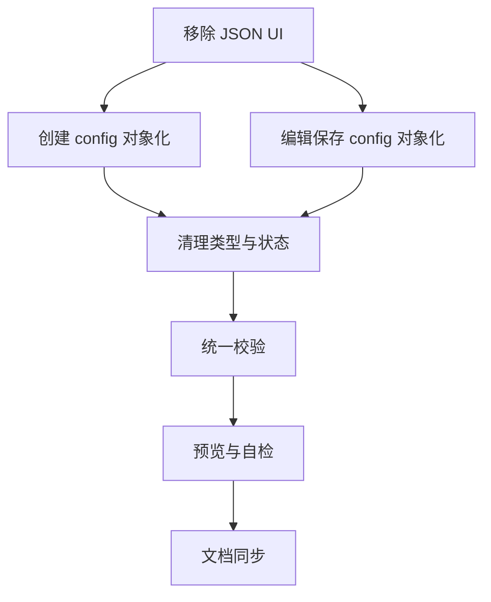

# TASK — 任务管理简化改造（原子化拆分）

更新时间：2025-10-31 00:20（UTC+8）

## 1. 原子任务清单
1) 移除参数配置页“配置模式”切换与 JSON 面板（UI）。
   - 输入契约：TaskManagement 组件现有 UI；
   - 输出契约：仅展示页面配置表单；
   - 验收：页面无 JSON 文本域与相关按钮；
   - 状态：已完成。

2) 统一创建任务 `config` 构建为对象模式（含 output）。
   - 输入契约：FormData 页面配置字段；
   - 输出契约：Task.config 对象；
   - 验收：不包含字符串 JSON 分支；
   - 状态：已完成。

3) 统一编辑保存任务 `config` 为对象模式（含 output）。
   - 输入契约：编辑态 FormData；
   - 输出契约：Task.config 对象更新；
   - 验收：不包含字符串 JSON 分支；
   - 状态：已完成。

4) 清理类型与状态：移除 `hyperparameterMode`、`manualConfig` 字段及重置逻辑。
   - 输入契约：FormData 类型定义与 setFormData 重置点；
   - 输出契约：类型与状态无 JSON 字段；
   - 验收：全局检索无引用；
   - 状态：已完成。

5) 校验逻辑统一为页面配置校验。
   - 输入契约：FormData；
   - 输出契约：validateForm 仅校验页面字段；
   - 验收：无 JSON 校验分支；
   - 状态：已完成。

6) 预览与自检。
   - 输入契约：DevServer；
   - 输出契约：页面正常，无控制台错误；
   - 状态：已完成。

7) 文档同步。
   - 输入契约：说明文档与对齐文档；
   - 输出契约：更新进度与共识文档；
   - 状态：进行中（持续更新）。

## 2. 任务依赖图（mermaid）

