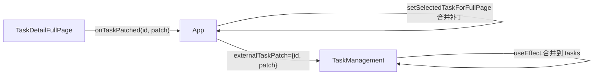

# DESIGN_任务详情与列表状态同步

更新时间：2025-10-31（UTC+8）

## 1. 架构概览（Mermaid）

## 2. 模块职责
- TaskDetailFullPage：产生补丁；本地覆盖展示；上报给父级。
- App：桥接层，维护当前全屏任务与向列表透传的补丁。
- TaskManagement：消费补丁并合并到列表数据。

## 3. 接口契约
- onTaskPatched(taskId: string, patch: Partial<Task>): void
- externalTaskPatch?: { id: string; patch: Partial<Task> } | null

## 4. 数据流与异常
- 数据单向流动；任一环节错误（try/catch）不影响本地展示。
- 重复补丁为幂等覆盖。

## 5. 扩展性与一致性
- 后续可将补丁事件改为全局事件总线或状态库。
- Task 类型在两个组件内重复定义，原型阶段暂不统一抽离。

