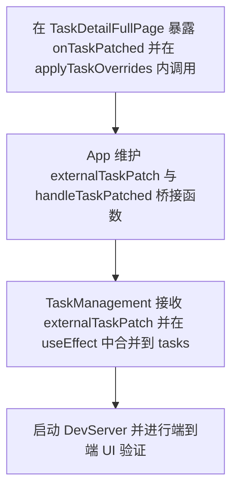

# TASK_任务详情与列表状态同步

更新时间：2025-10-31（UTC+8）

## 1. 任务依赖图

## 2. 原子任务定义

### T1 在 TaskDetailFullPage 暴露 onTaskPatched 并在 applyTaskOverrides 内调用
- 输入契约：现有 TaskDetailFullPage 组件；本地覆盖逻辑已存在。
- 输出契约：props.onTaskPatched(taskId, patch) 在补丁生成时被调用。
- 实现约束：TypeScript 类型安全；不破坏现有 UI 行为；记录日志一致。
- 验收标准：触发任意动作后 console 不报错；回调按预期被调用。

### T2 TaskManagement 接收 externalTaskPatch 并在 useEffect 中合并到 tasks
- 输入契约：props.externalTaskPatch: { id, patch } | null。
- 输出契约：本地 tasks 对应 id 的项合并 patch 并触发重渲染。
- 实现约束：幂等覆盖；仅当 id 匹配时更新。
- 验收标准：列表按钮文案与状态随补丁即时更新。

### T3 App 维护 externalTaskPatch 与 handleTaskPatched 桥接函数
- 输入契约：来自 T1 的 onTaskPatched。
- 输出契约：
  - setSelectedTaskForFullPage 合并 patch；
  - setExternalTaskPatch({ id, patch }) 传递给 TaskManagement。
- 实现约束：不引入全局状态；不产生无限循环渲染。
- 验收标准：详情页与列表页保持一致。

### T4 启动 DevServer 并进行端到端 UI 验证
- 输入契约：Vite dev 脚本。
- 输出契约：浏览器可访问且无报错；交互验证通过。
- 实现约束：不修改后端；仅使用模拟数据。
- 验收标准：手动路径验证“取消排队→重新运行”一致性。

