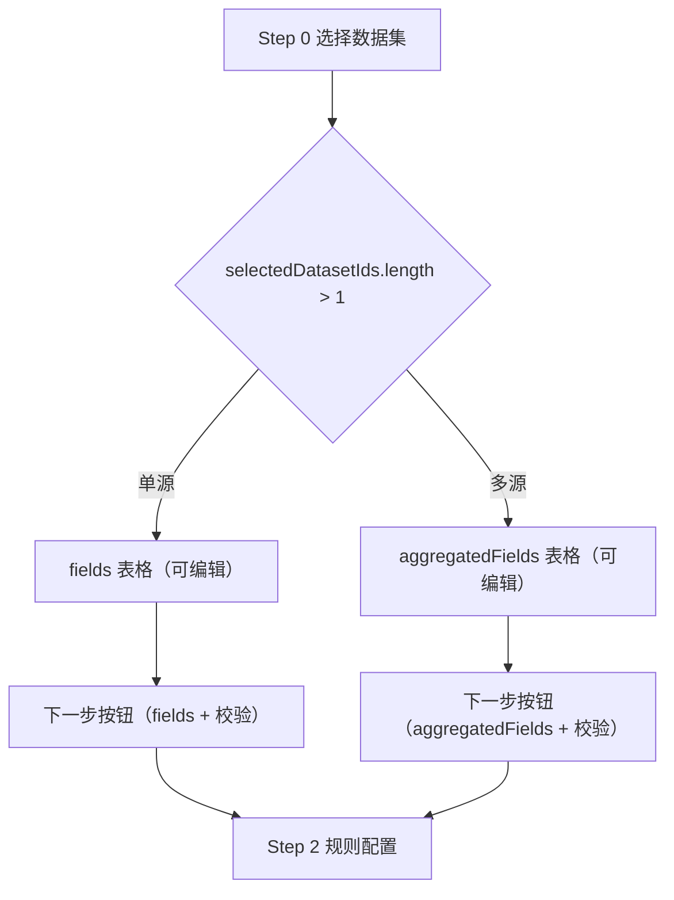

# 设计文档：数据预处理-字段选择（多数据集）允许修改

## 架构概览（Mermaid）

## 模块与状态
- 单源编辑态：`fieldNameEditValues/Errors`、`duplicateNameSet/hasAnyNameError`。
- 多源编辑态：`aggFieldNameEditValues/Errors`、`aggDuplicateNameSet/hasAnyAggNameError`。

## 接口契约（前端状态）
- AggregatedField：`{ name, type, missingRate, duplicateRate, isUnique, sampleValues, selected, hasTypeConflict?, conflictTypes?, presentInCount? }`。

## 数据流与事件
- Input.onChange → 更新 `aggFieldNameEditValues` 与错误校验；
- Input.onBlur → `handleAggFieldNameChange`（落盘到 `aggregatedFields` + 同步规则字段名）；
- Select.onValueChange → `handleAggFieldTypeChange`（落盘到 `aggregatedFields`）；
- NextButton.disabled → 根据单/多源分别使用对应集合与错误状态。

## 异常处理策略
- 空值/重复名 → toast + 行内错误；
- 类型冲突提示保留，不阻断编辑。