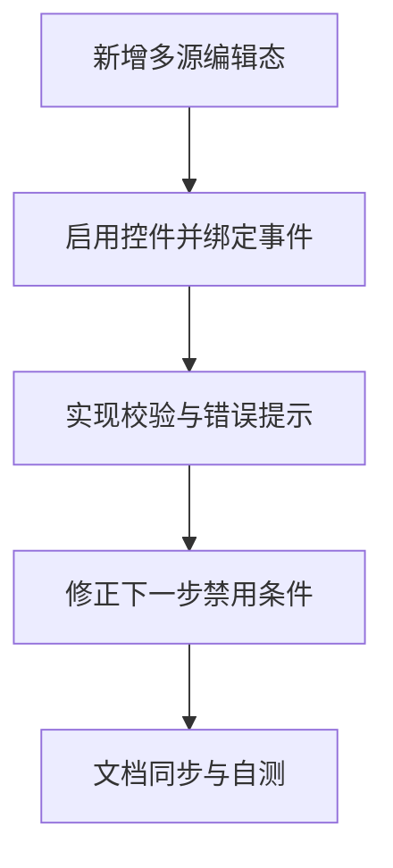

# 原子任务拆分：数据预处理-字段选择（多数据集）允许修改

## 任务列表
1. 新增多源编辑态与校验状态（aggFieldNameEditValues/Errors、aggDuplicateNameSet/hasAnyAggNameError）
   - 输入契约：`aggregatedFields` 已生成；
   - 输出契约：状态变量与派发函数；
   - 验收：状态初始化无报错。
2. 启用多源 Input/Select 控件并绑定编辑事件
   - 输入契约：React 组件渲染多源表格；
   - 输出契约：字段名与类型可编辑；
   - 验收：控件不再 disabled。
3. 实施校验与错误提示（空值、重复名）
   - 输入契约：编辑态值集合；
   - 输出契约：错误态 UI 与阻断逻辑；
   - 验收：错误出现时禁止下一步。
4. 修正下一步按钮禁用条件（区分单源/多源）
   - 输入契约：所选字段集合与错误标记；
   - 输出契约：Next 按钮 disabled 表达式；
   - 验收：满足条件时可进入下一步。
5. 文档同步与自测
   - 输入契约：上述实现完成；
   - 输出契约：更新说明文档与本目录文档；
   - 验收：预览验证 5 条用例全部通过。

## 依赖关系图
