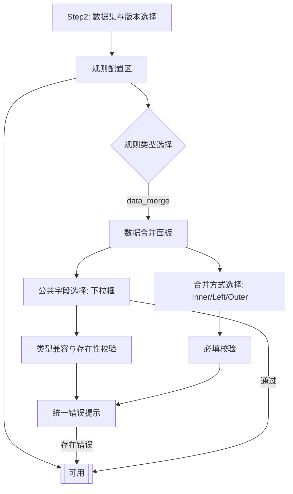
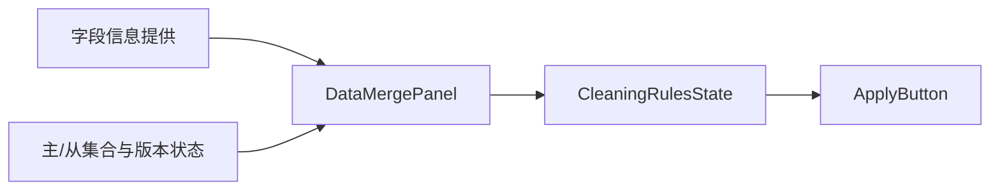

# 阶段2：Architect / DESIGN（数据合并规则 - 公共字段）

## 整体架构（Mermaid）

## 分层设计与核心组件
- 规则模型：`CleaningRule` 扩展 `type='data_merge'`，`config={ primaryDatasetId, primaryVersionId, secondaryDatasetId, secondaryVersionId, commonField, joinType }`。
- 初始化：`updateCleaningRule` 根据 Step2 状态设定默认主/从与版本，`commonField` 为空、`joinType` 为空。
- 面板渲染：在 `DataPreprocessing.tsx` 中呈现公共字段下拉、合并方式选择与错误提示（主/从数据集信息不再展示）。
- 全局校验：在提交按钮 `disabled` 条件中对启用的 `data_merge` 规则执行公共字段与合并方式的合法性判断。

## 模块依赖图

## 接口契约定义（前端原型）
- 输入契约：
  - Step2 主/从数据集与版本；
  - 字段信息（包含 name/type）。
- 输出契约：
  - 更新后的 `CleaningRule`（data_merge）配置：`{ commonField, joinType }`；
  - 全局校验状态影响 `handleApply`。

## 数据流向与异常策略
- 数据流：用户在面板中选择公共字段与合并方式 → 更新规则状态 → 校验结果影响提交按钮。
- 异常：
  - 无公共字段/类型不兼容/未选择合并方式 → 面板与统一提示 → 禁用提交；
  - 任何不确定性立刻中断并提示用户完善配置。