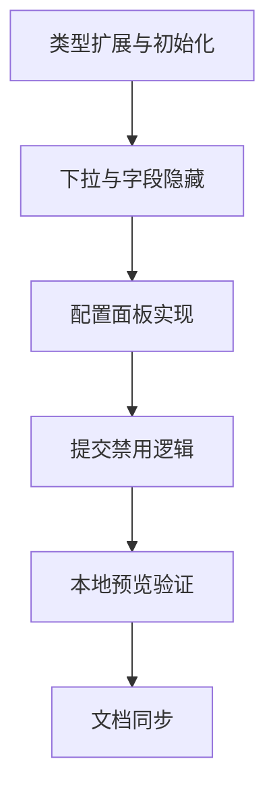

# 阶段3：Atomize / TASK（数据合并规则 - 公共字段）

## 原子任务拆分
1. 扩展类型与初始化（已完成）
   - 输入：现有 `CleaningRule` 模型与 `updateCleaningRule`；
   - 输出：支持 `data_merge` 类型并默认填充主/从与版本、`commonField` 与 `joinType`；
   - 验收：编译通过，面板可选择 `数据合并` 类型。

2. 规则类型下拉与字段选择隐藏（已完成）
   - 输入：类型下拉与单字段选择控件；
   - 输出：新增 `数据合并` 选项并隐藏该类型的单字段选择；
   - 验收：UI 行为与其他规则一致。

3. 配置面板实现（已完成）
   - 输入：字段信息与 Step2 状态；
   - 输出：主/从信息只读展示；公共字段选择；合并方式选择；统一错误提示；
   - 验收：交互顺畅、错误提示清晰。

4. 全局提交禁用逻辑（已完成）
   - 输入：启用的 `data_merge` 规则集合；
   - 输出：若存在不合法规则（公共字段无效/类型不兼容/未选合并方式）则禁用提交按钮；
   - 验收：错误均可阻断，修正后可用。

5. 本地预览验证（进行中）
   - 输入：Vite 开发服务器；
   - 输出：覆盖 `Inner/Left/Outer` 三种方式与错误触发；
   - 验收：按钮状态正确、控制台无错。

6. 文档同步（待办）
   - 输入：上述实现与验证结果；
   - 输出：对齐、共识、设计、任务、验收文档；更新 `说明文档.md`。

## 任务依赖图（Mermaid）
