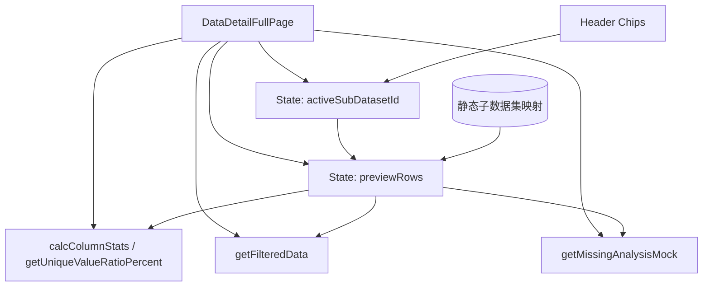

# 阶段2：DESIGN（系统架构与接口设计）

## 整体设计
以现有 DataDetailFullPage 为中心，注入“子数据集切换”与“预览数据源抽象”。

## 分层与核心组件
- 视图层：数据表预览卡片头部新增 Chips，用于选择子数据集。
- 状态层：新增 `activeSubDatasetId` 与 `previewRows`；切换时更新并重置过滤状态。
- 逻辑层：统计与过滤全部改造为基于 `previewRows`，避免对原有 `mockData` 的耦合。

## 模块依赖
- subDatasetRows 依赖 mockData 生成变体；无外部依赖。
- 统计/过滤函数依赖 allVariables（字段集合）与 previewRows。

## 接口契约
- handleSwitchSubDataset(id: string): 更新 activeSubDatasetId 与 previewRows，并重置过滤状态；同时同步 meta.stats.totalRows。
- calcColumnStats(): 基于 previewRows 计算每列缺失率、唯一值数量与占比。
- getFilteredData(): 基于缺失/唯一过滤状态返回表格数据。
- getMissingAnalysisMock(): 基于 previewRows 生成缺失分析指标。

## 数据流向
- UI Chips → handleSwitchSubDataset → previewRows → 统计与过滤函数 → 表格与标签展示。

## 异常处理策略
- 若 id 不存在，回退到 main；确保不抛出异常。
- 切换时重置过滤状态，避免逻辑冲突。

## 设计约束
- 不引入后端调用；仅前端演示。
- 不改变现有文件的对外接口与路由。