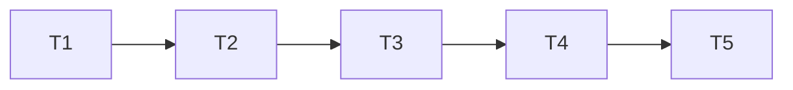

# 阶段3：TASK（原子化任务拆分）

## 原子任务清单

1. 注入子数据集状态与数据源
   - 输入：mockData, allVariables
   - 输出：activeSubDatasetId, previewRows, subDatasetRows 映射
   - 验收：默认主文件；预览无报错

2. 重构统计与过滤函数的输入源
   - 输入：previewRows
   - 输出：calcColumnStats/getUniqueValueRatioPercent/getFilteredData/getMissingAnalysisMock 均正确计算
   - 验收：切换后标签与总数联动

3. 增加 UI Chips 并联动切换
   - 输入：subDatasetOptions, handleSwitchSubDataset
   - 输出：头部 Chips；点击切换 previewRows 与 meta.stats.totalRows；重置过滤状态
   - 验收：交互流畅、布局不乱

4. 动态总记录数与提示文案
   - 输入：previewRows.length
   - 输出：总记录数卡片与“共计 N 行”随切换更新；Tooltip 总数引用 previewRows.length
   - 验收：与当前子集一致

5. 预览与测试
   - 输入：开发服务器
   - 输出：在浏览器预览 Chips 切换、过滤联动与统计更新
   - 验收：无控制台错误

## 依赖关系（Mermaid）
